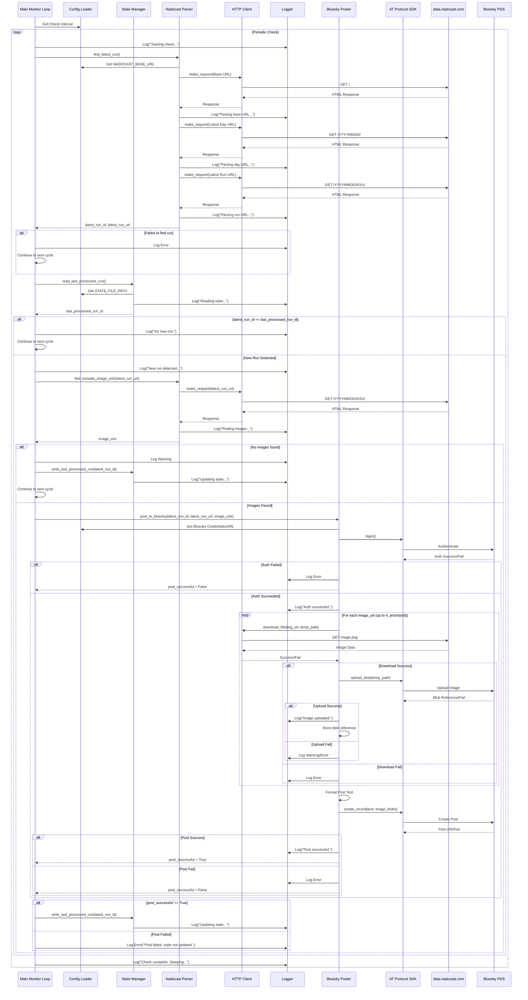

# NADOCast Monitor - System Architecture

## 1. Overview

This document describes the architecture for the NADOCast Monitor tool. The system periodically checks the NADOCast data server (`http://data.nadocast.com/`) for new tornado forecast runs, identifies specific forecast images within the latest run, and posts a notification with these images to Bluesky using the AT Protocol. The architecture emphasizes modularity, configurability via environment variables, and robustness through error handling and retries.

## 2. Component Breakdown

The system is composed of the following core components, largely mirroring the pseudocode modules:

1.  **`Main Monitor` (`main_monitor.py`)**:
    *   **Responsibility:** Orchestrates the main application loop. Schedules periodic checks based on the configured interval. Coordinates interactions between other components (Parser, State Manager, Poster). Handles top-level error catching within the loop.
    *   **Key Interactions:** Calls `Nadocast Parser` to find the latest run, `State Manager` to read/write the last processed run ID, and `Bluesky Poster` to send notifications.

2.  **`Config Loader` (`config.py`)**:
    *   **Responsibility:** Loads and validates configuration parameters from environment variables. Provides constants for use by other modules (URLs, credentials, intervals, file paths, retry settings). Ensures required variables are present.
    *   **Key Interactions:** Provides configuration values to all other components that need them.

3.  **`State Manager` (`state_manager.py`)**:
    *   **Responsibility:** Manages the persistent state of the monitor, specifically the identifier of the last successfully processed forecast run. Reads from and writes to a state file (e.g., `last_run.txt`).
    *   **Key Interactions:** Called by `Main Monitor` to get the last processed run ID and to update it after a successful post. Uses `Config Loader` for the state file path. Uses `Logger` for status/error messages.

4.  **`HTTP Client` (`http_client.py`)**:
    *   **Responsibility:** Provides a reusable and robust way to make HTTP requests (GET). Implements configurable retry logic for transient network errors (timeouts, connection errors, 5xx status codes). Handles basic error logging for requests. Includes functionality for downloading files.
    *   **Key Interactions:** Used by `Nadocast Parser` to fetch HTML directory listings and by `Bluesky Poster` to download images. Uses `Config Loader` for retry settings. Uses `Logger` for request/retry/error messages.

5.  **`Nadocast Parser` (`nadocast_parser.py`)**:
    *   **Responsibility:** Interacts with the NADOCast data server. Navigates the directory structure (`YYYYMMDD/tXXz/`) by fetching and parsing HTML listings to find the URL and identifier of the latest forecast run. Identifies and extracts the URLs of specific tornado forecast images (`*_conus_tornado_*.png`, `*_conus_sig_tornado_*.png`) within the latest run directory.
    *   **Key Interactions:** Called by `Main Monitor`. Uses `HTTP Client` to fetch HTML content. Uses `Config Loader` for the base NADOCast URL. Uses `Logger` for status/error messages. Requires an HTML parsing library.

6.  **`Bluesky Poster` (`bluesky_poster.py`)**:
    *   **Responsibility:** Handles all interactions with the Bluesky API (AT Protocol). Authenticates using credentials from `Config Loader`. Downloads the identified tornado images (using `HTTP Client`). Uploads images to the Bluesky PDS. Formats the notification message (including run details and NADOCast URL). Creates and sends the post with text and embedded images. Implements retry logic for image uploads and posting. Prioritizes `sig_tornado` images and respects the 4-image limit.
    *   **Key Interactions:** Called by `Main Monitor`. Uses `Config Loader` for Bluesky credentials and PDS URL. Uses `HTTP Client` to download images. Uses `Logger` for status/error messages. Requires an AT Protocol SDK.

7.  **`Logger` (`logger.py`)**:
    *   **Responsibility:** Provides a centralized logging facility. Configures log format and output (e.g., console). Offers different log levels (INFO, WARNING, ERROR).
    *   **Key Interactions:** Used by all other components to log informational messages, warnings, and errors.

## 3. Interactions & Data Flow

The typical workflow involves the following sequence:

**Data Flow Summary:**

*   **Configuration:** Environment Variables -> `Config Loader` -> All other components.
*   **State:** `State File` <-> `State Manager` <-> `Main Monitor`.
*   **NADOCast Data:** `data.nadocast.com` -> `HTTP Client` -> `Nadocast Parser` (HTML for URLs) -> `Main Monitor` (Run ID, Run URL, Image URLs).
*   **Image Data:** `data.nadocast.com` -> `HTTP Client` -> `Bluesky Poster` (Temporary local files) -> `AT Protocol SDK` -> `Bluesky PDS`.
*   **Bluesky Post:** `Main Monitor` (Run ID, Run URL) + `Bluesky Poster` (Image Blob Refs) -> `AT Protocol SDK` -> `Bluesky PDS`.

## 4. Technology Choices (High-Level - Based on Spec Pseudocode)

*   **Runtime:** Python 3.10+ (as suggested by Dockerfile `FROM python:3.10-slim`)
*   **HTTP Requests:** `requests` library (robust, widely used, supports streaming for downloads).
*   **HTML Parsing:** `BeautifulSoup4` with `lxml` parser (flexible and efficient HTML parsing).
*   **AT Protocol Interaction:** `atproto` SDK (official or community-maintained Python library for Bluesky).
*   **Logging:** Python's built-in `logging` module (configurable and standard).
*   **Concurrency:** Single-threaded main loop with `time.sleep`. No complex concurrency needed for the current scope.
*   **Packaging/Dependencies:** `pip` and `requirements.txt`.
*   **Containerization:** Docker (as required by FR8).

## 5. Scalability & Reliability

*   **Reliability:**
    *   **Error Handling:** Explicit error handling (try/except blocks) in network operations, file I/O, and API interactions.
    *   **Retries:** The `HTTP Client` implements retries with backoff for transient network errors during NADOCast fetching and image downloading. The `Bluesky Poster` implements retries for image uploads and posting.
    *   **Logging:** Comprehensive logging helps diagnose issues.
    *   **State Management:** Persisting the last processed run prevents duplicate posts after restarts or transient failures.
    *   **Configuration:** Using environment variables avoids hardcoding and simplifies deployment configuration.
*   **Scalability (Future Considerations):**
    *   The current design is single-threaded and polls one source.
    *   **Polling Frequency:** The check interval is configurable. Too frequent polling could lead to rate-limiting or banning.
    *   **Multiple Sources:** If monitoring more sources were required, the core logic could be refactored, potentially using asynchronous operations (`asyncio`) or a task queue.
    *   **State Storage:** For higher reliability or distributed deployment, the flat file state could be replaced with a database or key-value store.
    *   **Distributed Monitoring:** Running multiple instances would require careful state management to avoid race conditions or duplicate posts (e.g., using atomic updates in a shared state store).

## 6. Output

This architecture overview is designed to be saved as `ARCHITECTURE.md`. It provides a blueprint for development, aligning with the specifications in `NADOCAST_MONITOR_SPEC_V2.md`.